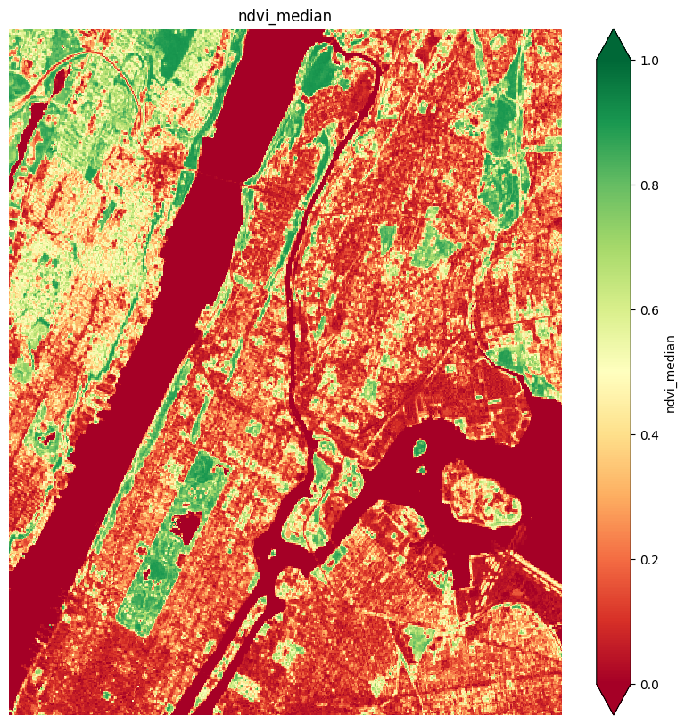
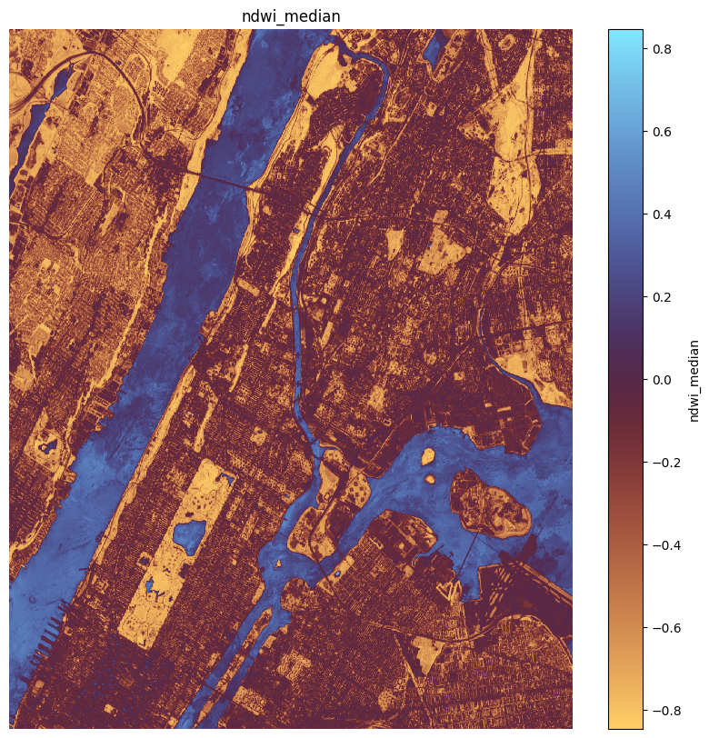
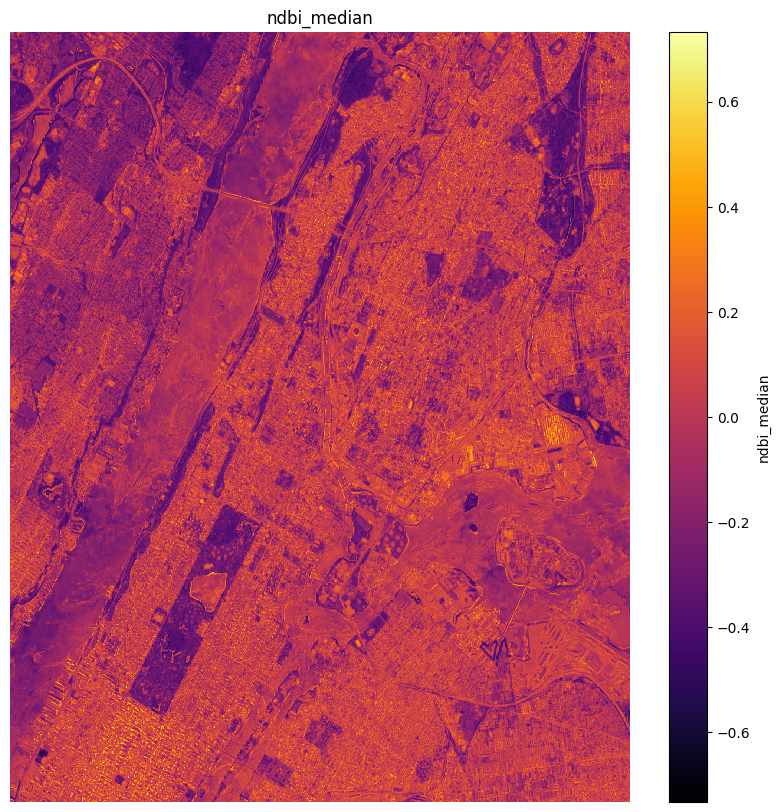
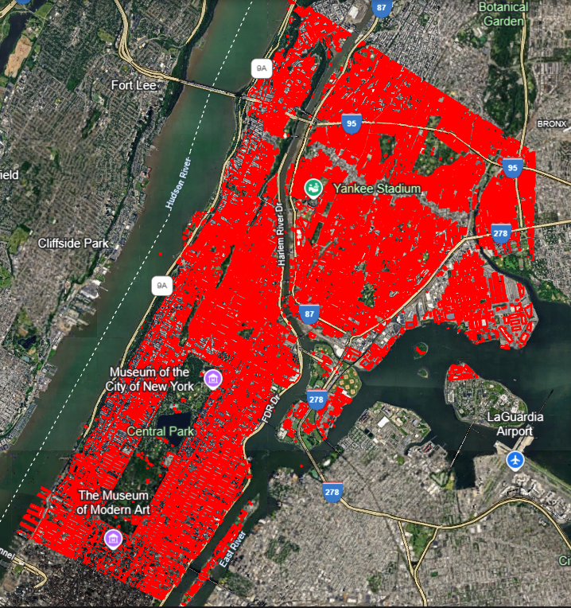
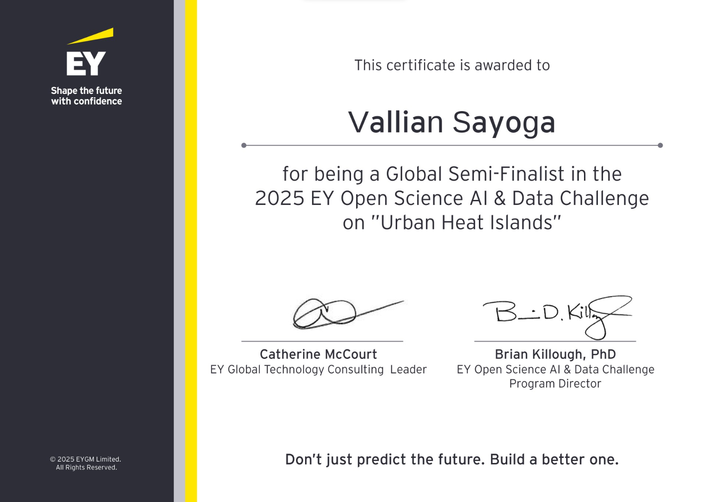

# 🚀 From a complete beginner to a Top 10 Global Finalist 🌍

I began learning programming at the end of my university years as an Agronomy student. My first exposure was through R—valuable, but it didn’t quite click. That changed when I discovered Python. Suddenly, things made sense.

I dove deep—learning data analysis and machine learning through Coursera courses, building projects via Udemy and YouTube, and exploring datasets on Kaggle.

Last year, I stumbled upon the EY Open Science Data Challenge 2024. The task? A computer vision problem. I didn’t even make it past the minimum threshold for a completion certificate. It was humbling.

But this year was different.

The 2025 challenge was a regression task: **predicting the Urban Heat Island (UHI) index** in New York City. UHI reflects how urban factors amplify local heat. The dataset included satellite imagery via an API and a building footprint KML file—my first time working with such data.

# 🔍 I engineered a variety of features:
Here's how I created new features beyond the recommendation:  
* Extracted RGB, infrared, water vapor indices from [Planetary Computer's API](https://planetarycomputer.microsoft.com/)
* Created NDVI, NDBI, NDWI, and more

* Parsed the KML file to derive building counts, proximity metrics, and shape complexity

* Modeled solar radiation data using [PVLIB](https://github.com/pvlib/pvlib-python)
* Queried [OpenStreetMap API](https://www.openstreetmap.org/) to identify green elements like trees, shrubs, and grasslands

# The results?

Out of **2,076 participants**, as a solo team, I achieved:  
🏅 Top 10 global external finalist  
📈 Top 16 global model performance  
🌏 Top 5 model performance in Southeast Asia  
🇮🇩  Top 1 model in Indonesia  

Curious about my approach? Check out my code here:  
🔗[My GitHub repo](https://github.com/valliansayoga/ey-data-challenge-2025)

This journey has been nothing short of transformational. I look forward to next year’s challenge—and to continuing my contribution to solving real-world problems with data.

Thank you for reading!

#DataScience #MachineLearning #UrbanHeatIsland #SatelliteImagery #OpenData #Python #EY #PVLIB #OpenStreetMap #ClimateTech #EYDataChallenge #AIForGood #LearningByDoing
